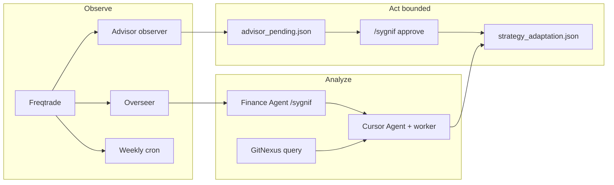

# Auto improvement workflow (Sygnif + agents + GitNexus)

**UTC context:** use timestamps in ISO UTC for any `strategy_adaptation.json` or advisor metadata.

## Goal

A **repeatable loop** that improves *analysis quality* and *bounded strategy tuning* without autonomous exchange orders. Automation may **propose** changes; **humans** (or `/sygnif approve`) apply validated overrides.

## Available “agents” (runtime)

| Agent / service | Role in improvement |
|-----------------|---------------------|
| **Cursor Cloud Agent** + **`cursor-agent-worker.service`** | Code/strategy work in-repo; inherits `.cursor/rules` and finance-agent prompts. |
| **Finance Agent** (`finance_agent/bot.py`, Telegram) | Market/TA/research, `/sygnif` cycle bundle, LLM synthesis; **analysis-only** for trades. |
| **Trade Overseer** (`trade-overseer`, :8090) | Open-trade monitoring, LLM commentary, `/overview` + `/trades` for feedback. |
| **Advisor observer** (`scripts/sygnif_advisor_observer.py`) | Scheduled state + optional **heuristic** pending rows in `advisor_pending.json`. |
| **Weekly cron** (`scripts/weekly_strategy_analysis.py`) | Horizon snapshot + 7d trade stats → `strategy_adaptation_weekly.json` (sidecar) + embedded **`ms3_metrics`** (NT perf + tag families + trading success bundle). |
| **Daily cron** (`scripts/collect_ms3_metrics.py`) | Writes `user_data/market_strategy_3_metrics.json` + JSONL + appends `entry_performance.jsonl` — see `docs/market_strategy_3.md` §9. |
| **6h cron** (`scripts/cron_trading_success.sh`) | Telegram trading success (1d) + strategy path tracker; 7d variants log-only. |

## GitNexus “nodes” (when to use)

Indexed repos (see skill **finance-agent**):

| Repo | Typical queries |
|------|-----------------|
| **Sygnif** (this repo) | `populate_entry_trend`, `confirm_trade_entry`, `custom_exit`, `strategy_adaptation`, slot caps. |
| **NostalgiaForInfinity** | Reference patterns only — read **targeted** sections, not whole file. |

**Practice:** before editing symbols, run **`gitnexus_impact`** / **`gitnexus_detect_changes`** per project rules; use **`gitnexus_query`** for “who calls X?” and **`gitnexus_context`** on hot symbols.

## Core analysis loop (Sygnif Agent)

Aligned with `.cursor/rules/sygnif-predict-workflow.mdc`:

1. **Predict** — scenarios, levels, falsifiers, horizon.
2. **Analyze** — Bybit data, TA score / signals from `finance_agent` where relevant.
3. **Proofread** — numbers, contradictions, language.
4. **Adjust** — bounded changes only:
   - **Horizon:** `scripts/prediction_horizon_check.py` (`save` / `check`).
   - **Strategy:** `user_data/strategy_adaptation.json` overrides validated by `user_data/strategy_adaptation.py` (`BOUNDS`).

## Auto-improvement pipeline (orchestration)



### Triggers

| Trigger | What runs | Output |
|---------|-----------|--------|
| **On a schedule** | `ADVISOR_BG_INTERVAL_SEC` → observer | `advisor_state.json`, optional `advisor_pending.json` |
| **Weekly (Sun 06:00 UTC)** | `weekly_strategy_analysis.py` | `strategy_adaptation_weekly.json` (+ `ms3_metrics`) + Telegram/log |
| **Daily (06:15 UTC)** | `collect_ms3_metrics.py` | `market_strategy_3_metrics.json` + JSONL + entry_perf log |
| **Every 6h (:30 UTC)** | `cron_trading_success.sh` | `trading_success` Telegram + `strategy_paths` + logs |
| **Every 20m** | `scripts/sentiment_health_watch.py` | Log always; **@sygnif_agent_bot** if sentiment/HTTP urgent **or** any `enter_tag` has **5 consecutive losing** closes (`close_profit < 0`) in spot/futures DB (see `.cursor/rules/sygnif-sentiment-layer.mdc`) |
| **Weekly (optional, research)** | `predict_protocol_gate_optimizer.py` | Offline **walk-forward** gate search on public 5m klines; log JSON + human review before any `.env` change (see Swarm section below). |
| **On demand** | `/sygnif`, `/finance-agent cycle`, Cursor task | LLM + raw bundle |
| **Before code edits** | GitNexus impact / query | Safer refactors |

### Approval gates (mandatory for “live” strategy changes)

1. **Proposals** land in `advisor_pending.json` or Cursor PR — not directly on the exchange.
2. **Apply** validated overrides via **`/sygnif approve <id>`** or manual edit of `strategy_adaptation.json` (same schema).
3. **Never** grant the finance-agent **autonomous** `force_enter` / `force_exit` — out of scope for this workflow.

## JSON / strict outputs

For Linear / Cloud tasks that must be machine-readable, follow **`cloud-runbook.md`** keys and **`mode_router.py`** modes (`futures_long`, `futures_short`, `spot`).

## Quick checklist (operator)

- [ ] Worker health: `CURSOR_WORKER_HEALTH_URL` (default `:8093/healthz`).
- [ ] Overseer: `OVERSEER_URL` `/overview` responds.
- [ ] `SYGNIF_REPO` points at the repo with `user_data/strategy_adaptation.json`.
- [ ] `.env` for Docker: escape **`$`** in passwords as **`$$`** (Compose interpolation).
- [ ] After bounded tuning: run **`pytest`** for strategy tests when Python changes.

## Swarm auto-improvement (telemetry loop)

**Purpose:** a **Swarm-native** observe → persist trail for fusion / gates / briefing — **no orders**, no automatic `strategy_adaptation.json` writes.

| Piece | Role |
|-------|------|
| `scripts/swarm_auto_improvement_flow.py` | Each run: `compute_swarm()`, optional `write_fused_sidecar` (`SYGNIF_SWARM_IMPROVEMENT_FUSION_SYNC=1`), delta vs last state, append `prediction_agent/swarm_auto_improvement_history.jsonl`, write `swarm_auto_improvement_state.json` + **hints** (conflict persistence, mean sign flip, source shifts). |
| `scripts/swarm_analyze_btc.py` | Heavier **train + read-only** swarm loop (ML/channel refresh); use when you want model JSON refreshed, not only fuse. |
| `scripts/swarm_auto_predict_protocol_loop.py` | **Venue** auto path with `SYGNIF_SWARM_GATE_LOOP` — trading; keep **ACK** gates; not the same as improvement telemetry. |

**Schedule (example):** cron every 15–60m: `cd ~/SYGNIF && python3 scripts/swarm_auto_improvement_flow.py`  
**Tight loop (dev only):** `SWARM_IMPROVE_INTERVAL_SEC=120 python3 scripts/swarm_auto_improvement_flow.py --loop`

Use hints + history to tune `swarm_order_gate.py` env, channel training cadence, or TA snapshot freshness — then validate bounded changes via the **Act bounded** gates above.

**Offline Swarm + predict-protocol P/L (research):** `scripts/predict_protocol_offline_swarm_backtest.py` replays **5m fit + decide_side** on public klines, optional **`swarm_fusion_allows`** with **simulated `vote_btc_future` = simulated position**, optional **intrabar TP/SL**, and `--grid-mean-long` for a coarse **`SWARM_ORDER_MIN_MEAN_LONG`** sweep. **`--offline-hm-source demo_once|demo_refresh`** maps **`sources.hm`** from **Bybit demo** `position/list` (`BYBIT_DEMO_*`) — **as-of API time**, not true per-bar history. Does **not** replace live `btc_predict_protocol_loop.py` (no venue).

**Full gate hyperparameter search:** `scripts/predict_protocol_gate_optimizer.py` — **Optuna TPE** (default) or **random** or **pyswarms** (continuous subset + bool preset) over **all** `swarm_fusion_allows` env knobs (mean bounds, conflict, bf/hm/nautilus/fusion/ML logreg, …). Uses the same offline sim; **`pip install optuna`** from `requirements-dev.txt`.

**Walk-forward:** `--walk-forward --wf-folds 4` splits the trailing `--hours` window; slice **0** is in-sample for the search, later slices are **OOS**. By default **position state carries** from IS into each OOS slice (`walk_forward_report.wf_carry_state`); use **`--wf-independent-folds`** if every slice should start flat. **`--log-jsonl PATH`** appends trial lines (`wf_phase`: `is_search`, `is_rerun_carry_seed`, `oos_fold`).

**Cron example (weekly, low priority, UTC):** append a log and review manually — not applied to production `.env` automatically.

```cron
15 4 * * 1 cd /home/ubuntu/SYGNIF && \
  OUT=prediction_agent/gate_opt_wf_$(date -u +%F).jsonl && \
  python3 scripts/predict_protocol_gate_optimizer.py --walk-forward --wf-folds 4 \
  --engine optuna --trials 80 --hours 96 --seed $(date +%s) --log-jsonl "$OUT" >> /tmp/gate_opt_cron.log 2>&1
```

**CI:** scripts are **byte-compiled** in `.github/workflows/python-ci.yml`. Optional end-to-end smoke (slow, Bybit + ML): `SYGNIF_GATE_OPT_SMOKE=1 pytest -m integration tests/test_predict_protocol_gate_optimizer_integration.py`.

## Related files

- `.cursor/cursor-agent-config.md` — worker + Telegram alignment.
- `AGENT_OPS_README.md` — ops summary.
- `scripts/prediction_horizon_check.py` — horizon discipline.
- `user_data/strategy_adaptation.py` — override rails.
- `scripts/swarm_auto_improvement_flow.py` — Swarm improvement telemetry.
- `scripts/predict_protocol_offline_swarm_backtest.py` — offline gated protocol P/L sim.
- `scripts/predict_protocol_gate_optimizer.py` — Optuna / random / pyswarms gate search.
