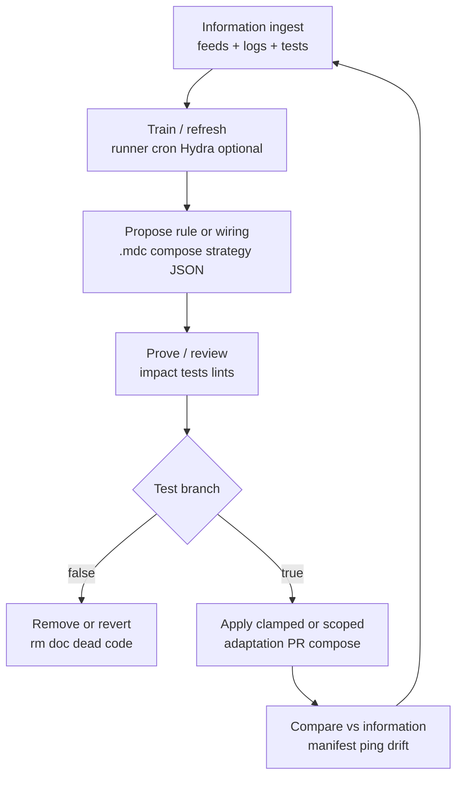

# Continuous rule loop, agent consultation, and **btc_Trader_Docker** data flows

**Compose note (2026-04):** dedicated BTC Docker services (`nautilus-research`, `freqtrade-btc-*`, grid) were **removed** from `docker-compose.yml`. Treat mentions of those service names below as **host `research/nautilus_lab/`** or **`archive/freqtrade-btc-dock-2026-04-13/`** unless you restore the old stack.

**Under `/ruleprediction-agent`:** treat this file as the **long-form** companion to `.cursor/rules/ruleprediction-agent.mdc` — rules and wiring **evolve**; this document describes the **information → training → rule change → proof → test → apply/remove → compare** loop and concrete **data sources** (TradingView, exchanges, on-chain bundles).

**Rule setting never stops:** each cycle produces evidence; **false** hypotheses → delete or narrow rules/docs; **true** under defined tests → apply (code, `strategy_adaptation.json`, compose, or `.mdc` globs). Re-compare against **live feeds** next cycle.

**Operational checklist (incoming data → rule rows):** **`letscrash/RULE_GENERATION_FROM_INCOMING_DATA.md`** — use with **`.cursor/rules/ruleprediction-agent.mdc`** when invoking **`/ruleprediction-agent`** for data-driven rule work.

---

## 1. Consult other agents (before changing rules or Docker)

| Agent / skill | Path | When to pull in |
|---------------|------|------------------|
| **prediction-agent** | `.cursor/agents/prediction-agent.md` | `prediction_agent/`, ML horizons, runner, Pine reference |
| **market-data** | `.cursor/agents/market-data.md` | ErcinDedeoglu daily bundle interpretation, funding/OI context |
| **btc-specialist** | `.cursor/agents/btc-specialist.md` | Bybit spot BTCUSDT, `pull_btc_context`, Sygnif TA semantics |
| **finance-agent** | `.cursor/agents/finance-agent.md` | `/briefing`, Telegram parity, `bot.py` ground truth |
| **sygnif-agent-inherit** | `.cursor/rules/sygnif-agent-inherit.mdc` | Worker identity, skills table, adaptation JSON contract |
| **sygnif-predict-workflow** | `.cursor/rules/sygnif-predict-workflow.mdc` | Predict → Analyze → Proofread → Adjust (narrative + horizon) |

---

## 2. Closed-loop (continuous)

- **Information:** `manifest.json`, Bybit ticker/klines, `btc_prediction_output.json`, horizon check outputs, Docker logs, `/api/v1/ping`, `GET /briefing` shape.
- **Training:** bounded jobs only (see `ruleprediction-agent` RAM section).
- **Rule modify:** `.cursor/rules/*.mdc`, `letscrash/*.md`, compose — version in git; never “silent prod”.
- **Prove:** `pytest`, manual `curl`, `prediction_horizon_check.py check`, GitNexus impact for strategy symbols.
- **If false → rm:** delete misleading lines, revert PR, drop env flags.
- **If true → apply:** merge PR, reload FT adaptation, redeploy container with new image digest.
- **Compare:** same metrics next cycle — detect regime / feed drift.

---

## 3. **btc_Trader_Docker** — directed data flows

| Direction | Channel | Content |
|-----------|---------|---------|
| **In** | `SYGNIF_SENTIMENT_HTTP_URL` | `finance-agent:8091/sygnif/sentiment` — MLP / HTTP sentiment for strategy |
| **In** | Mounted `user_data/` | `SygnifStrategy`, `strategy_adaptation.json`, configs, feather data |
| **In** | Exchange REST/WS | Bybit spot **BTC/USDT** (Freqtrade **CCXT**) |
| **In** | `nautilus-research` + **`bybit_nautilus_spot_btc_training_feed.py`** | **Nautilus `BybitHttpClient`** (not CCXT), **spot BTC/USDT only** — writes `btc_1h_ohlcv.json`, `btc_daily_90d.json`, `btc_1h_ohlcv_nautilus_bybit.json`, `nautilus_spot_btc_market_bundle.json` → **training channel** + `btc_predict_runner` + regime; compose: **`docker-compose.yml` profile `btc-nautilus`** |
| **In** | (optional future) | Read-only mount or HTTP for **prediction** / **yfinance** sidecars — document before enable |
| **Out** | Webhooks | `notification-handler:8089` — trades, fills (align `trading_mode` / `bot_name`) |
| **Out** | Freqtrade REST | Host-mapped port (e.g. **8282** → container **8080**) |
| **Out** | Logs | `user_data/logs/freqtrade-btc-spot.log` |

**No second :8091** inside the trader image — **ruleprediction-agent** port contract.

### Futures `freqtrade-btc-0-1` — automatic leverage, entries, exits

| Layer | Mechanism | Notes |
|-------|-----------|-------|
| **Leverage** | `SygnifStrategy.leverage()` (inherited by `BTC_Strategy_0_1`) | Major pair tier (e.g. BTC), **shorts capped at 2x**, **ATR%** scales max lev down; Freqtrade applies at order time. |
| **Entries** | `populate_entry_trend` → `confirm_trade_entry` | **R01 / R02 / R03** tags, registry **bucket** + **slot** gates, **R01** training-runner governance. |
| **Exits** | `custom_exit` / `custom_stoploss` + parent exits | **R03** scalp TP/RSI; **R02** regime break; **R01** stack guard; normal Sygnif / ROI / exchange SL paths. |
| **Operator RPC** | `POST /api/v1/forceenter` | **Optional** — does not replace the automatic paths above. |

### Nautilus research = in-network **data processing** (predict + develop)

Docker service **`nautilus-research`** (compose profile **`btc-nautilus`**, network **`sygnif_backend`**) runs the lab scripts (e.g. `run_nautilus_bundled.sh`) and **writes/refreshes** JSON under **`finance_agent/btc_specialist/data/`** (OHLCV, `nautilus_spot_btc_market_bundle.json`, sidecar signal). That feed is the **upstream processor** for:

- **`training_pipeline` / `channel_training.py`** → `training_channel_output.json`
- **`btc_predict_runner.py`** → `btc_prediction_output.json`
- **R01 live governance** and **`/ruleprediction-agent`** evidence loop (bounded; RAM rules in `.cursor/rules/ruleprediction-agent.mdc`)

Traders **read** the same mount (read-only where configured) for **Nautilus nudge** / context; **heavy transforms stay in `nautilus-research`**, not duplicated inside `freqtrade-btc-0-1`.

**Schedule alignment (default):** `nautilus-research` **`NAUTILUS_BYBIT_POLL_SEC=300`** (5‑minute Bybit OHLCV/bundle refresh) + host **`systemd/ruleprediction-pipeline.timer`** at **`*-*-* *:07:00`** → `channel_training` runs a few minutes after the hour so the closed 1h bar is available while sink data stays fresher between hours; **only one** heavy training job runs at a time (`.cursor/rules/ruleprediction-agent.mdc` RAM). Set e.g. **3600** in `.env` to reduce API poll frequency.

### Training pipeline (`sygnif-training-pipeline`)

Bounded channel job: **inflow** = mounted `finance_agent/btc_specialist/data/*.json` (Bybit OHLCV); optional subprocess `btc_predict_runner.py` → `prediction_agent/btc_prediction_output.json`. **Recognition / risk outflow** = `prediction_agent/training_channel_output.json` (holdout `p_up` / `p_down`, Brier, empirical win/loss when model predicts up, naive VaR on 1-bar returns, max drawdown disclaimer).

| Direction | Channel | Content |
|-----------|---------|---------|
| **In** | `./finance_agent:/app/finance_agent:ro` | `btc_1h_ohlcv.json`, `btc_daily_90d.json` |
| **In** | `./prediction_agent:/app/prediction_agent:rw` | Live `btc_predict_runner.py` + write targets |
| **Out** | Same `prediction_agent` mount | `btc_prediction_output.json` (runner), `training_channel_output.json` (channel) |

Start (merge with main compose so `sygnif_backend` exists): `docker compose -f docker-compose.yml -f docker-compose.training-pipeline.yml up -d --build sygnif-training-pipeline`. Env: `SKIP_PREDICT_RUNNER`, `RUNNER_TIMEFRAME`, `WINDOW`, `TEST_RATIO`, `TRAINING_LOOP_SECONDS` (default 21600). One-shot local: `SKIP_PREDICT_RUNNER=1 PYTHONPATH=prediction_agent .venv/bin/python training_pipeline/channel_training.py`.

**Cross-link:** R01 live gate = `prediction_agent/training_channel_output.json`; Nautilus = upstream inflow only unless mirrored to `finance_agent/btc_specialist/data/btc_1h_ohlcv.json` — see `user_data/strategies/btc_strategy_0_1_engine.py`, `prediction_agent/btc_predict_runner.py`, **`letscrash/RULE_GENERATION_FROM_INCOMING_DATA.md`** §5.

---

## 4. Indicators and feeds — priority wishlist (extend in PRs)

### TradingView / Pine (repo)

| Item | Location | Use |
|------|----------|-----|
| **5m Pine spec** | `prediction_agent/btc_predict_5m.pine` | Visual / export alignment; **not** live FT unless ported |
| **LuxAlgo Swing Failure Pattern** | `prediction_agent/reference/luxalgo_swing_failure_pattern_cc_by_nc_sa_4.pine` | TV v5 reference (pivots, LTF volume %, confirmation); **CC BY-NC-SA 4.0** — **NonCommercial** may block commercial deployment; align semantics with `SygnifStrategy` swing tags only after legal review |
| **Official TV page** | [YmWELClV](https://www.tradingview.com/script/YmWELClV-Swing-Failure-Pattern-SFP-LuxAlgo/) | Source-of-truth for updates; republishing subject to TV [House Rules](https://www.tradingview.com/support/solutions/43000590599/) |
| **QuantumEdge-style risk / TP ladder** | `reference/quantum_edge_manual_pro_mpl2.pine` (**MPL 2.0**) | Inspiration for **BTC dump protection** design — `letscrash/BTC_DUMP_PROTECTION_DESIGN.md` |
| **State-aware MA (chikaharu)** | `reference/chikaharu_state_aware_ma_cross_mpl2.pine` (**MPL 2.0**) | Regime + defensive exit pattern vs dump framing |
| **Trend Volatility Index TVI (chikaharu)** | `reference/chikaharu_trend_volatility_index_tvi_mpl2.pine` (**MPL 2.0**) | Dispersion of multiple SMAs → TVI synthetic candles; pair with ATR / HL-range for **vol expansion** vs dump chop |
| **Custom TV indicators** you add | document path + data export | Map to JSON columns or manual CSV → runner features |

**BTC dump protection (Sygnif + continuous rules):** **`letscrash/BTC_DUMP_PROTECTION_DESIGN.md`** — maps TV ideas to FT tags, adaptation JSON, and the prove/test/apply loop under **`ruleprediction-agent`**.

### Exchange / CEX

| Feed | API | Notes |
|------|-----|------|
| Spot OHLCV / ticker | Bybit v5 `category=spot&symbol=BTCUSDT` | Ground for `btc_specialist` + FT |
| Perps (if strategy uses) | Bybit linear | Pair naming `BTC/USDT:USDT` vs spot |

### On-chain / derivatives **daily** (CC BY 4.0)

| Series (examples) | Upstream file | Sygnif consumer |
|--------------------|---------------|-----------------|
| Exchange netflow | `btc_exchange_netflow.json` | `crypto_market_data.py`, briefing subset |
| Funding (daily agg) | `btc_funding_rates.json` | market-data agent |
| Open interest | `btc_open_interest.json` | volatility context |
| MVRV, liquidations, … | other `data/daily/*.json` | extend `DEFAULT_PATHS` / analysis md cautiously |

**Attribution:** [ErcinDedeoglu/crypto-market-data](https://github.com/ErcinDedeoglu/crypto-market-data).

### Other

| Feed | Path / tool |
|------|-------------|
| **yfinance** | In **btc_Trader_Docker** image; use for **off-FT** research only unless explicitly wired |
| **NewHedge** | `NEWHEDGE_API_KEY`, correlation JSON |
| **Horizon discipline** | `scripts/prediction_horizon_check.py` |

---

## 5. “If true apply” — safe apply layers

| Layer | Mechanism |
|-------|-----------|
| Lowest risk | Update **this** markdown + cross-links |
| Low | `strategy_adaptation.json` overrides (clamped) |
| Medium | Compose env / image tag for **btc_Trader_Docker** |
| High | Strategy code, new HTTP routes — **tests + GitNexus impact** |

---

*Iterate: append dated notes at bottom or use git history; keep rules and compose traceable.*
